# a-light-unto-my-path

For my MVP project, I have chosen to create a blog—one that is deeply personal and meaningful to me. I have found that when I work on something that truly resonates with my heart, my motivation and outlook improve tremendously.

A Light Unto My Path was born from a desire to share my journey of spiritual growth with others. My life has taken many unexpected turns, but I now find myself in a space of gratitude, drawing ever closer to God. This is especially significant given my background—I was raised in a conservative environment, and as a gay person, I have experienced firsthand the tension between faith and identity. These two aspects of my life often felt at odds, like water and oil.

However, as I found my own path back to God, I came to understand a truth that I believe many in my community need to hear: God's love is unconditional. Too many LGBTQ+ individuals have been led to believe that they are unwelcome in faith, that they have been cast aside. Through this blog, I hope to challenge that misconception and offer a message of inclusion, love, and spiritual hope.

If even one person reads my words and feels reassured of their worth in God's eyes, then this project will have been a success.

---

## CONTENTS

* [User Experience](#user-experience-ux)
  * [User Stories](#user-stories)

* [Design](#design)
  * [Colour Scheme](#colour-scheme)
  * [Typography](#typography)
  * [Imagery](#imagery)
  * [Wireframes](#wireframes)

* [Features](#features)
  * [General Features on Each Page](#general-features-on-each-page)
  * [Future Implementations](#future-implementations)
  * [Accessibility](#accessibility)

* [Technologies Used](#technologies-used)
  * [Languages Used](#languages-used)
  * [Frameworks, Libraries & Programs Used](#frameworks-libraries--programs-used)

* [Deployment & Local Development](#deployment--local-development)
  * [Deployment](#deployment)
  * [Local Development](#local-development)
    * [How to Fork](#how-to-fork)
    * [How to Clone](#how-to-clone)

* [Testing](#testing)

* [Credits](#credits)
  * [Code Used](#code-used)
  * [Content](#content)
  * [Media](#media)
  * [Acknowledgments](#acknowledgments)

---

## User Experience (UX)

"A light unto my path" is a Christian blog dedicated to faith-based discussions, spiritual growth, and community engagement. We feature a new help/contact page to encourage our readers to share their thoughts, reflections, and insights and offer a safe place to reach out for help. Readers can post comments on the different blog posts, sharing their view and experiences.

### Key Information for the Site
  - The current blog post page.
  - A Quiz page.
  - A contact/help page, offering a  way for visitors to contact us with questions, prayer requests, or verse recommendations.
  - A about page to explain the thought and intention of the site.

### User Stories

#### Client Goals

  - Ensure the website is accessible across all devices
  - Make it easy for new visitors to understand the mission of the blog and how to participate
  - Provide an easy way for visitors to contact us with questions, prayer requests, or verse suggestions

#### First-Time Visitor Goals

  - Learn about the purpose of [Alight unto my path] and how to get involved.
  - Easily navigate the site to find relevant information
  - Locate our social media profiles to stay connected

#### Returning Visitor Goals

  - Easily contact us for further inquiries or prayer support
  - Easily login to access comments and posts (CRUD)

#### Frequent Visitor Goals

  - Submit verse recommendations for future discussions

## Design

### Colour Scheme

[View Color Palette on Coolors](https://coolors.co/)

- Cambridge Blue (#6C9A8B) – Calm, Renewal, Stability

  This muted greenish-blue evokes a sense of tranquility, balance, and connection to nature. It is often associated with healing, growth, and emotional well-being.

- Coral Pink (#E8998D) – Warmth, Compassion, Playfulness

  Coral pink is inviting and friendly, symbolizing love, optimism, and emotional warmth. It can bring a sense of joy and creativity while still being soothing.

- Pale Dogwood (#EED2CC) – Softness, Innocence, Serenity

  This light, dusty pink conveys gentleness, tenderness, and quiet elegance. It can give a sense of comfort, peace, and nostalgia.

- Isabelline (#FBF7F4) – Purity, Simplicity, Lightness

  A near-white shade, Isabelline represents clarity, freshness, and minimalism. It carries a sense of openness, new beginnings, and peace.

- Raw Umber (#A1683A) – Earthiness, Strength, Warmth

  This rich, warm brown exudes stability, grounding, and resilience. It has a natural, organic feel, symbolizing tradition, reliability, and warmth.

- Together, this palette conveys a harmonious blend of warmth, peace, and groundedness, making it ideal for themes
  related to spirituality, comfort, and emotional depth.

### Typography

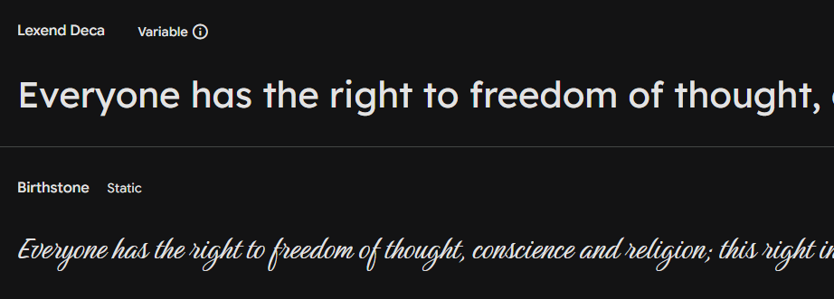

- Lexend Deca brings a modern, clean, and highly readable touch to my project.
- Designed to improve legibility and reduce visual stress, it ensures clarity in digital and print formats, making content easy to consume while maintaining
  a sleek, professional aesthetic.

- Imperials Script, on the other hand, adds elegance and sophistication with its flowing, calligraphic style.
- It introduces a sense of refinement and creativity, making it perfect for accents, headlines, or branding elements that need a touch of luxury and
  personality.

- Together, these fonts balance readability with artistic expression, creating a visually appealing and engaging experience.

[Google Fonts](https://fonts.google.com/)

### Imagery

- The images were all created with [Freepik](https://www.freepik.com/)
- Each image tries to reflect the emotion of the post.
- Blog images are added via the admin site.

### Wireframes

## Features

The website consists of six pages, five of which are accessible from the navigation menu (Homepage, About, Blog, Contact, Quiz and Login/Sign Up). The sixth page is a Logout Confirmation Page, which appears in a pop-up modal when a user chooses to log out.

Global Features
Each page on the website includes:

A Responsive Navigation Bar:

  - The navbar allows users to navigate the site easily.
  - On the left side, it features an image logo alongside the text "A Light Unto My Path."
  - On the right side, users can access links to Home, About, Blog, Contact, and Login/Sign Up (or Logout if logged in).
  - The navigation links collapse into a hamburger menu for a clean and intuitive user experience.

A Footer with Social Media Links:

  - Includes icons linking to Facebook, X (Twitter), Instagram, and YouTube.
  - The use of universally recognizable icons ensures a clean and user-friendly design.

### Page Breakdown

Home Page

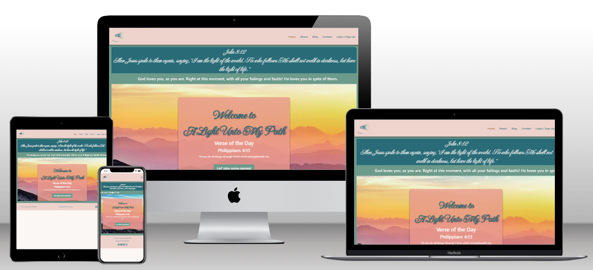

  - Features a rolling banner with a statement of love.
  - A daily bible verse is added to the hero overlay.
  - A link under the daily bible verse lead the user to a quiz game.

About Page

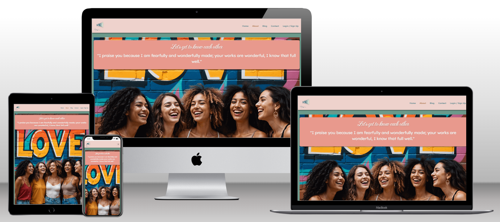

  - Provides a structured breakdown of the site's purpose, goals, and background.

Blog Page

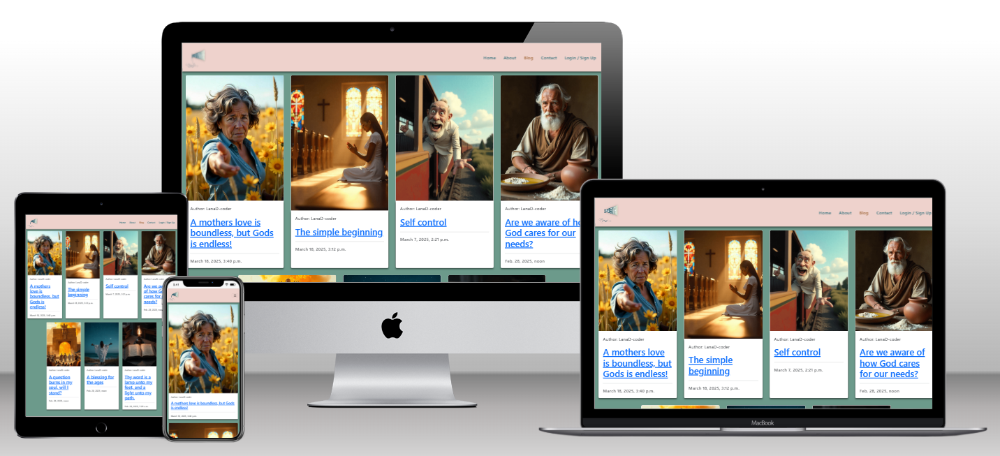

  - Displays a list of blog posts.
  - Users can browse different blog topics.
  - Allows users to scroll back to the navigation menu easily.

Contact Page

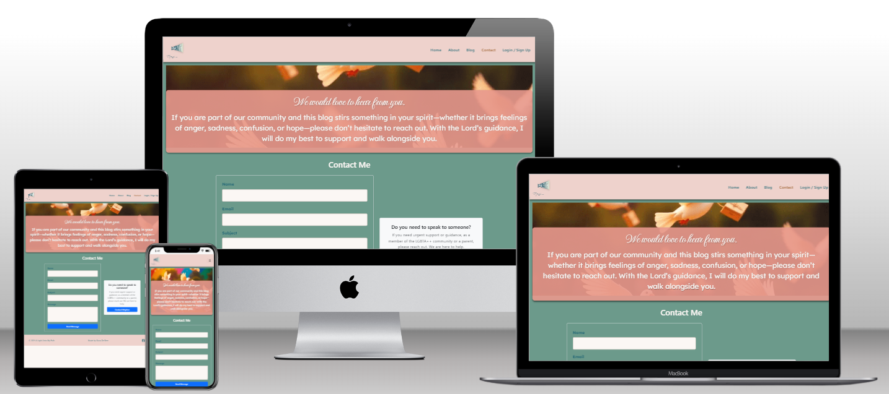

  - Fields: Name, Email and a Message Text Area.
  - Users must fill out required fields before submitting.

Login/Sign-Up Page

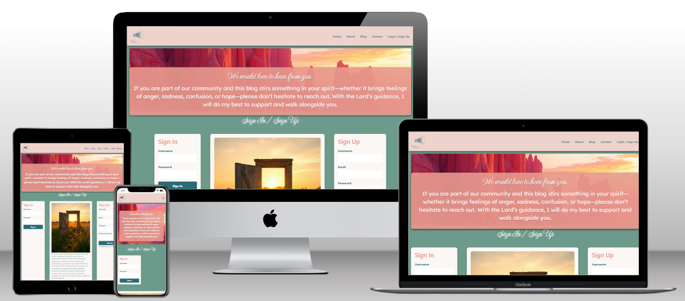

  - Provides a form for users to either log in or create an account.
  - Includes password validation and email verification prompts.

Quiz page

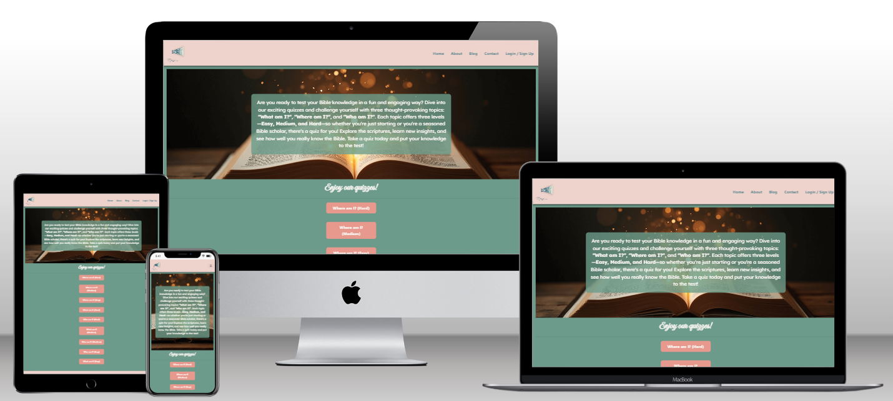

  - The Quiz page is accessed through a button on the Homepage.
  - It features mutiple quizzes.
  - Each quiz topic has 3 difficulty levels.
  - A confirmation modal pops up to start the quiz.
  - A number of questions and score to pass is shown.
  - Once the quiz is completed, submitted, the score if shown and the answers presented.

### Future Implementations

I would love to add the following in the future:

  - Video sections
  - Shelters and churches where help iis available.
  - Chat service

## Technologies Used

Languages Used

  - VSCode, Django, Python, HTML and CSS were used to create this website.

Frameworks, Libraries & Programs Used

  - Github - To save and store the files for the website.

  - Bootstrap Version 5.0 - The framework for the website.

  - Google Fonts - To import the fonts used on the website.

  - Font Awesome - For the iconography on the website.

  - Google Dev Tools - To troubleshoot and test features, solve issues with responsiveness and styling.

  - Tiny PNG and Bulk Resize Photos were used to compress images.

  - Favicon.io To create favicon.

  - Techsini is used to create the mockups.

  - Clean CSS (https://www.cleancss.com/css-minify/) and (https://www.cleancss.com/css-beautify/) was used to minify and beautify CSS.

## Deployment & Local Development

The site is deployed using [GitHub](https://github.com/LanaD-cell/a-light-unto-my-path) and [Heroku](https://dashboard.heroku.com/apps/alight-untomy-path).

### To Deploy the site using GitHub Pages:

  - Login (or signup) to Github.
  - Go to the repository for this project, LanaD-cell/a-light-unto-my-path.
  - Click the settings button.
  - Select pages in the left hand navigation menu.
  - From the source dropdown select main branch and press save.
  - The site has now been deployed, please note that this process may take a few minutes before the site goes live.

### Local Development

To clone the repository:

  - Log in (or sign up) to GitHub.
  - Go to the repository for this project, LanaD-cell/a-light-unto-my-path.
  - Click on the code button, select whether you would like to clone with HTTPS, SSH or GitHub CLI and copy the link shown.
  - Open the terminal in your code editor and change the current working directory to the location you want to use for the cloned directory.
  - Type 'git clone' into the terminal and then paste the link you copied in step 3. Press enter.

### Deployment on Heroku

  - Login to Heroku at Heroku Dashboard.
  - Create a New App (New > Create new app).
  - Connect GitHub under the Deploy tab.
  - Deploy by selecting a branch and clicking Deploy Branch.
  - Enable Auto Deploys (optional).
  - View App by clicking Open app.

## Testing

### Running Automated Tests

  Prerequisites
- Ensure your virtual environment is activated:
  MacOS/Linux
  - source myenv/bin/activate
  Windows
  - myenv\Scripts\activate

  Run migrations:
  python manage.py makemigrations
  python manage.py migrate

### Running Tests with test.py

  To run all tests:
  - python manage.py test
  - When testing specific apps, add the app anme at the end of the above command

## Manual Testing Checklist

  - All HTML pages and the CSS were run through the W3Validators (NU Html checker).

[W3Validator](https://validator.w3.org/)

[W3Validator](https://jigsaw.w3.org/css-validator/)

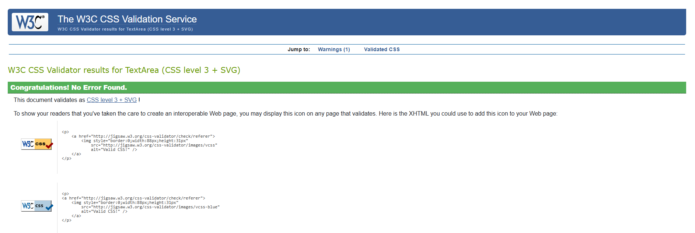

I used the following steps to run my site through Lighthouse, for mobile and desktop tests.

Why Use Incognito for Lighthouse?
  - No extensions interfering
  -  No cached assets (fresh load every time)
  - No logged-in state affecting page content
  - Less background noise from Chrome
  - More realistic performance metrics

How to Use Incognito for Lighthouse?
  - Open an Incognito window (Ctrl + Shift + N on Windows/Linux, Cmd + Shift + N on Mac)
  - Open DevTools (F12) > Lighthouse Tab
  - Select "Mobile" and "Performance"
  - Click Analyze Page Load

This ensures clean, unbiased Lighthouse results every time!

Using Incognito Mode for Lighthouse tests ensures that you get accurate, unbiased results.

Here’s why it matters:

1. Prevents Browser Extensions from Skewing Results
Many Chrome extensions (like ad blockers, SEO tools, and custom scripts) inject extra JavaScript and CSS, which can slow down your page.
In Incognito Mode, extensions are disabled by default unless you manually enable them.
This ensures Lighthouse only measures your website’s actual performance.

2. Clears Cache & Cookies for a Fresh Load
Your browser caches images, stylesheets, and scripts to speed up repeat visits.
Lighthouse in regular mode might load cached assets, giving faster but misleading results.
In Incognito Mode, the site loads as if it’s a first-time visitor, providing a realistic test.

3. Avoids Logged-In User Data
If you’re logged into a website, extra scripts (e.g., analytics, admin toolbars, personalized content) can affect performance.
Incognito ensures you test the public-facing version of your site.

4. Prevents Background Activity from Interfering

Background tasks like:
  - Syncing Chrome accounts
  - Auto-playing videos
  - Open tabs running scripts can slow down the Lighthouse test.
Incognito Mode runs a cleaner environment with minimal interference.

5. Helps Debug Third-Party Issues
If your site relies on third-party scripts (e.g., Google Ads, Facebook Pixel), those might behave differently based on user history and cookies.
Incognito Mode runs without those, giving a true baseline performance score.

### Homepage Lighthouse
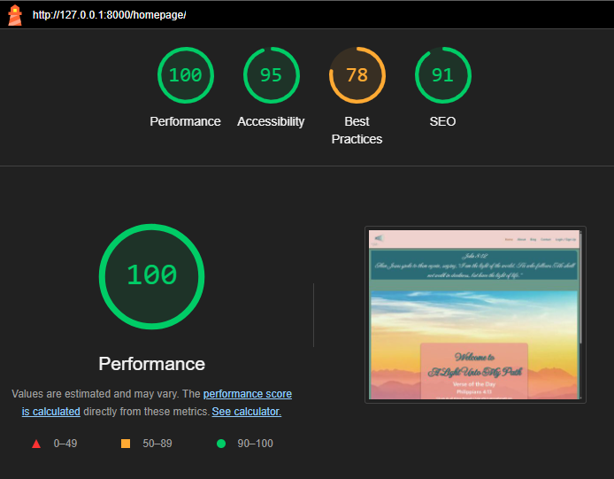
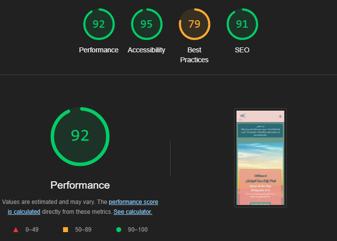

### About Lighthouse
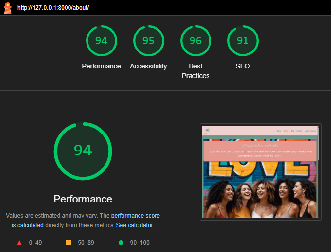
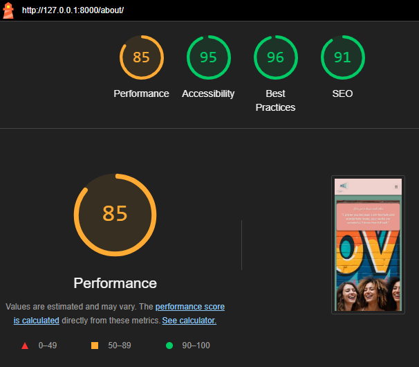

### Blog Lighthouse
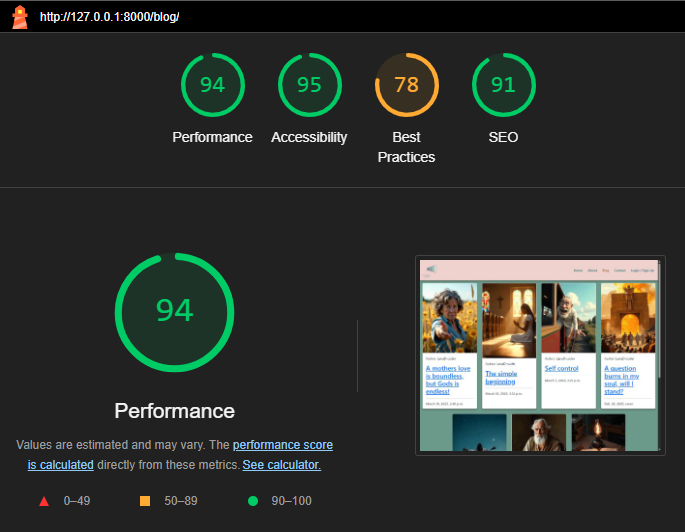
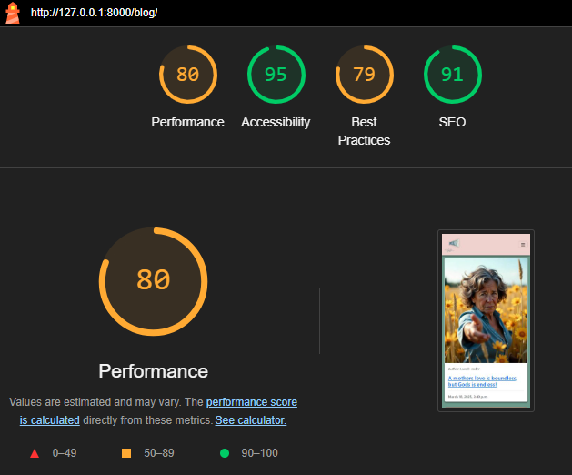

### Contact Lighthouse
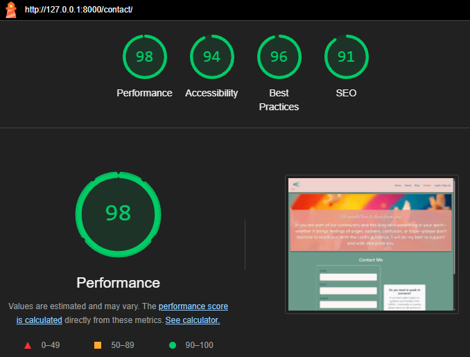
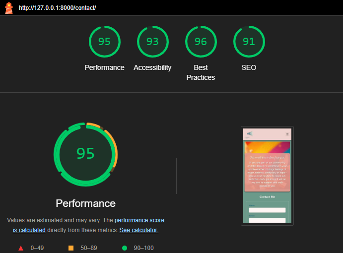

### Comment Lighthouse

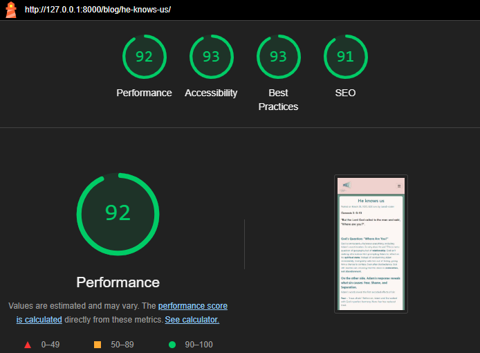

### Login/Signup Lighthouse
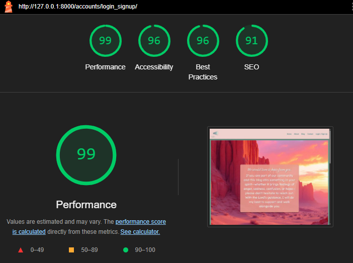
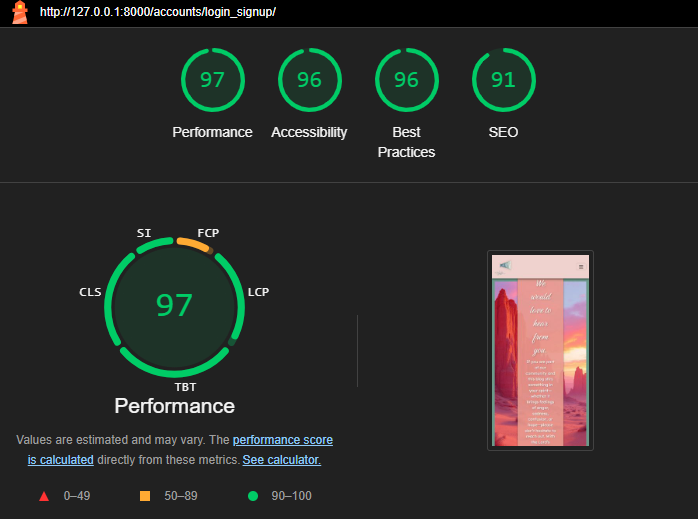

### Quizes Lighthouse
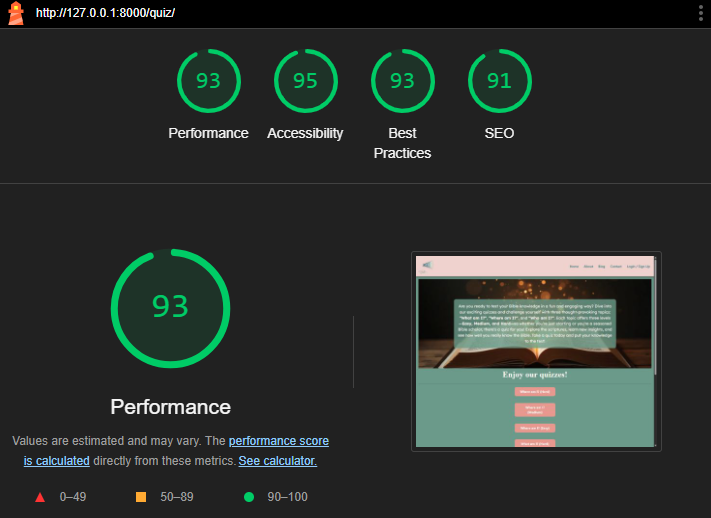

### About
  -

### Accounts

### Blog

### Contact

### Home Page
  - Open the homepage and verify that the **Daily Verse** is displayed.
  - Check if the verse updates daily.
  - Ensure the layout and styling match the expected design.

  - A error arises in the Homepage.html.
  - It is integrated into the code dynamically added to show the Daily Verse section on the Homepage.

### API Integration
  - Confirm the API key is set correctly in `settings.py`.
  - Ensure fetching the daily verse from the Bible API works without errors.

### Database
  - Verify that the **DailyVerse** model saves data correctly.
  - Check if the database updates the verse once per day.
  - Run `python manage.py shell` and test retrieving saved verses.

### User Experience
  - Ensure the navigation menu works properly.
  - Check if buttons and links redirect to the correct pages.
  - Test on different screen sizes (desktop, tablet, mobile).

## Reporting Issues

### Bug on Homepage
  - A error arises in the Homepage.html.
  - It is integrated into the code dynamically added to show the Daily Verse section on the Homepage.
  - Solution, I removed the 

 from the {{ daily_verse.verse_text|safe }}.

### CRUD for commenst on the Blog
  - Create, Read, Update, and Delete
  - The expected behavior of the website is that users must be registered (signed up) to comment on blog posts. Once a comment is submitted, it requires
    approval from the superuser before becoming visible. Only after approval can the user edit or delete their comment. This is an intentional feature, not a bug, as it helps maintain a respectful and meaningful discussion environment. Given the sensitive nature of the topics discussed and the Christian focus of the website, this approval process is in place to prevent spam and trolling. The requirement for registration and comment moderation is clearly explained on the Login/Signup page.

  
  

### Quizzes arrangement
  - I am having trouble rearranging the Quizzes into groups.
  - Each Quiz section, What am I?, Who am I? and Where am I?, has a difficulty level and should be grouped together.

   

## Credits

  - I used quite a large amount of extra learning material, as Django, VS Code etc. was a complete new concept for me.

  - Bootstrap5
    https://getbootstrap.com/docs/5.0/getting-started/introduction/

  - Medium
    https://medium.com/jungletronics/a-django-blog-in-vs-code-fb23335d9196

  - Python simplified
    https://www.youtube.com/watch?v=EEiqGjCNLRs

  - Dennis Ivy
    https://www.youtube.com/watch?v=0sMtoedWaf0

  - Programming with Moss
    https://www.youtube.com/watch?v=rHux0gMZ3Eg

  - API Bibles
    https://docs.api.bible/tutorials/verse-of-the-day/

  - Code with Tomi
    https://youtu.be/IpAk1Eu52GU?si=QGyHF45ZsctgQPE2

  - Code with Josh
    https://www.youtube.com/watch?v=FUrui0DpK5I

  - Pretty Printed
    https://youtu.be/ynToND_xOAM?si=s-bQ46eT3ApXGNT0

  - Pyplane
    https://www.youtube.com/watch?v=vXXfXRf2S4M

  - Pyplane
    https://www.youtube.com/watch?v=Eikwhxgkcag&t=3s
    How to create a Quiz app in Django with Javascript - part 1-5 was used to create the quiz.
    The Quiz questions and answers came from a game "The Action Bible Guess it game".

### Code Used

I used the code provided on the API Bible site to integrate my daily verse generator to the Homepage(https://docs.api.bible/tutorials/verse-of-the-day).

### Content

- All content on the website has been written by me.
- The website content is mainly personal opinion and highly personal to me.

###  Media

All media has been created on [Freepik](https://www.freepik.com/pikaso/ai-image-generator#from_element=creating&from_view=pikaso)
- The images are AI generated to suite each story. They get added directly via Admin.
- The resizing of all images were made using [TinyPNG](https://tinypng.com/) and [BulkResize](https://bulkresizephotos.com/en)

###  Acknowledgments

